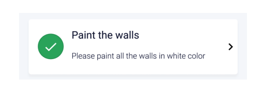
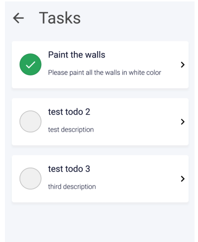

# Testing task

**endpoint-url**: `https://xxx.com/Tasks/Get`

**Parameters (via GET)**: project-id (the `id` oft he project for which the task should be listed; integer)

**Response:** This endpoint returns a json object (as string) containing the following data:

```json
{
  "task": [
    {
      "id": 1,
      "title": "Paint the wall",
      "description": "Please paint all the walls in white color",
      "checked": true
    },
    {
      "id": 2,
      "title": "Clean the site",
      "description": "Please make sure you cleaned the construction site before leaving",
      "checked": false
    }
  ]
}
```

---------


**Endpoint-url:** `https://xxx.com/Tasks/Save`

Parameters (via POST): project-id (integer), task-id (integer), checked (bool)

**Response:**, This endpoint returns a json object (as string) containing the following data: 

```json
{
  "status": "success"
},
{
  "status": "error"
}
```


**Task 1:**

Build a class for a Custom Element that represent an HTLM object for one task in a project.
This element should include the following properties: id, title, description, checked. Add a function to this class to load the data from a json object that is structured like this:

```json
    {
      "id": 1,
      "title": "Paint the wall",
      "description": "Please paint all the walls in white color",
      "checked": true
    },
```



Whenever the user clicks on this element the element’s checked property should change (to
false or to true depending on the previous value). Additionally, a POST request should be sent
to the https://xxx.com/Tasks/Save endpoint (this is an imaginary endpoint - i.e. it does not
exist) to save the new state of the task.
Please use vanilla Javascript for this task!

**Task 2:**
Build a second class for a Custom Element that holds multiple tasks (as custom elements
you defined in task 1) and displays these in a list



Once the element has been added to the DOM, the tasks should be fetched from the server
(using the https://xxx.com/Tasks/Get endpoint; again: this is an imaginary endpoint) and
displayed as a list.


**Task 3:**
Write at least one unit test for one test case that you come up with (feel free to choose any
that makes sense to you). You can use any unit test framework or write these tests in vanilla
Javascript.


